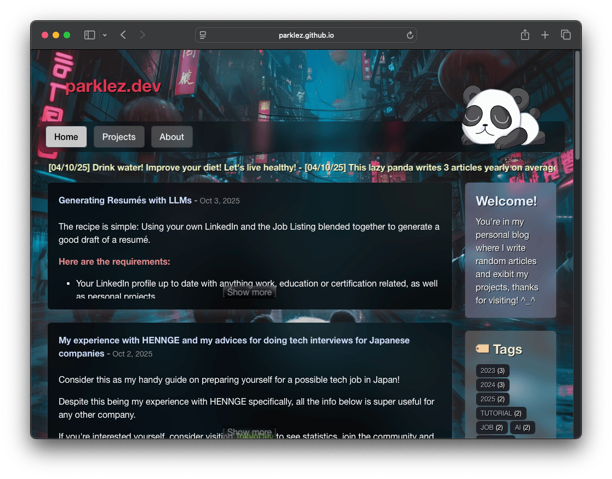

# parklez.dev
My personal "blog" of sorts for learning purposes, made with Angular framework.



### How does this project works?
- The Github Pages for this repository is available in the "`gh-pages`" branch. 
- The Angular project is compiled in Github Action's CI/CD, the resulting files are commited the aforementioned branch.
- The browsable contents are available in `_posts` & `_projects` directories. They're compiled by `blog/compile-static-content.js` during CI/CD and commited as JSON "assets" for later consumption by the front-end.

### Setup
- Use NodeJS compatible with Angular 20.

On `blog` directory, install dependencies:
```sh
npm install
```

### Running locally
On `blog` directory you can start the dev server using the following command:
```sh
npx ng start
```

To "compile" the markdown content to json, run this script:
```sh
node compile-static-content.js
```

### Misc. Versions
- This blog used to have a real server with user functionality as well as connections with database for storing and retrieving content - You can find this version here: [server branch](https://github.com/parklez/blog/tree/server).
