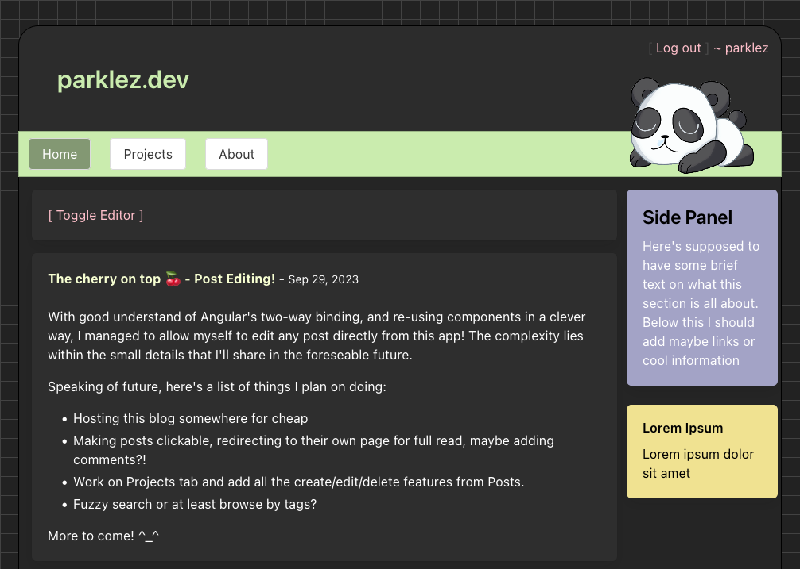

# parklez.dev
My personal "blog" of sorts for learning purposes, written in NodeJS & Angular.




## TO-DO list
> Server-side
- [ ] Implement paging for posts
- [ ] Implement paging for projects
- [ ] Implement update for posts & projects
- [ ] Implement delete routes for posts & projects
- [ ] Implement authentication for certain routes

> Client-side
- [ ] Add create post screen
- [ ] Add create project screen
- [ ] Add login screen
- [ ] Add edit button for posts/projects
- [ ] Delete button for posts/projects
- [ ] Add 404 page
- [ ] Add pagination
- [ ] Beautify header

#### Setup
- Use NodeJS 18 for this project.

On both `blog` and `server` directories, install dependencies:
```sh
npm install
```

#### Local development
On `blog` you can start the dev server using the following:
```sh
npx ng start
```
On `server` you can start it by doing:
```sh
npm run dev
```